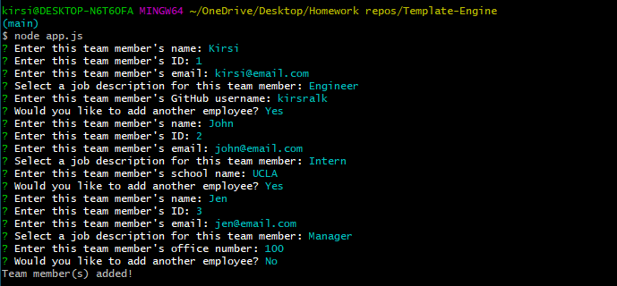

# Team Template-Engine

## Description 

Template Engine is a CLI based app that allows users to create a formatted HTML page displaying team member information.  Team members can be categorized as Manager, Engineer or Intern.

The formatted team.html page will automatically include links to email or view a team member on Github (if applicable).

* [Github Repository](https://github.com/kirsralk/Template-Engine).
* [Tutorial on Screencastify](https://drive.google.com/file/d/1c3fCWZhV4lY0BYk5Qp_vUCS-Xyt5CT9U/view?usp=sharing).
* App Screenshot:


### User Story

```
As a manager
I want to generate a webpage that displays my team's basic info
so that I have quick access to emails and GitHub profiles
```

## Installation

Note: This application runs on a Command Line Interface only (not in a browser).

### Step 1: Install Node

Ensnure you have the Node.js runtime environment installed on your machine.  Helpful instructions to install Node are available [here](https://coding-boot-camp.github.io/full-stack/nodejs/how-to-install-nodejs).

You can confirm if Node is properly installed on your machine by running the command "node -v" in your terminal, which will return the Node verison number you have installed. 

This project was created using Node v.14.15.4.

### Step 2: Install the Default NPM Package

Install the NPM CLI modules package by running the command "npm install" in your terminal.

By default, this will install all modules listed as dependencies in a new subfolder called node_modules and the package.json file.


### Step 3: Install Inquirer

Install the additional NPM package Inquirer by running the command "npm install inquirer" in your terminal.

This will install additional node_module files and package-lock.json.

You are now ready to run the Team Template Engine application!


## Usage 

* Invoke the application by running the "app.js" file within the Node environment (run the command "node app.js" in your terminal).

* Answer the prompts with text inputs or by selecting items from the list provided

* Once all of the prompts have been answered, app.js will execute the render() function thats creates a file under the /output/ folder called "team.html".  This is your new, fully formatted Team Roster!

For a video walkthrough of the app, check out the [Team Engine Tutorial](https://drive.google.com/file/d/1c3fCWZhV4lY0BYk5Qp_vUCS-Xyt5CT9U/view?usp=sharing).


## Credits

Created by Kirsi: https://github.com/kirsralk/


## License

[](https://opensource.org/licenses/MIT)